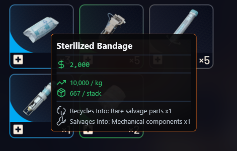
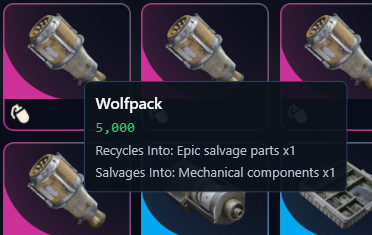

# Arc Scanner 
(Windows)

**Not affiliated with Embark Studios. Arc Raiders is a trademark of Embark Studios.**

Arc Scanner is a desktop companion app that scans item icons and shows value guidance in an in-game overlay.

(Image shown is fancy tooltip in settings)

## Who This Is For

- Players who want to know item value quickly
- Players who dont want to use overwolf (current apps scan slow, and have ads)
- Players who want a reliable app that is 100% external from game processes, memory, and files. (No hooks or injections)

## Download

Use the installers in `releases/`:

- Recommended: `ArcScanner-Setup-<version>.exe`
- Alternative: `ArcScanner-Setup-<version>.msi`

## Install

1. Download either installer (`.exe` or `.msi`) from `releases/`.
3. Run the installer.
4. Launch **Arc Scanner** from Start Menu or Desktop shortcut.

## First Use

1. Start Arc Scanner.
2. Leave Arc Scanner running while you play (X minimizes to taskbar).
3. Use the scan hotkey (default: `Shift+F`) when your cursor is over an item.
4. Review the tooltip (item name, estimated value, and optional info).

## Default Hotkeys

- Start Icon Scan: `Ctrl+F`
- Toggle Overlay: `Ctrl+Shift+O`
- Show / Hide Window: `Ctrl+Shift+M`
- Pause / Resume Scans: not set by default
- Show Last Scan: not set by default (repeats last scans info without needing to rescan, helpfull if you set a short tooltip popup and need to see it again.)

You can change all hotkeys in the **Hotkeys** tab.

## App Behavior

- Closing the main window keeps Arc Scanner running in the system tray.
- Use the tray icon menu to:
  - Open Arc Scanner
  - Check for updates
  - Exit

## Safety

Arc Scanner is designed as an external tool:

- No game memory read/write
- No code injection
- No game file modification

## Project Page

- https://arc-scanner.com/

## Contributing

If you want to help this project, contribute to https://github.com/RaidTheory/arcraiders-data.

(regular tooltip shown)
